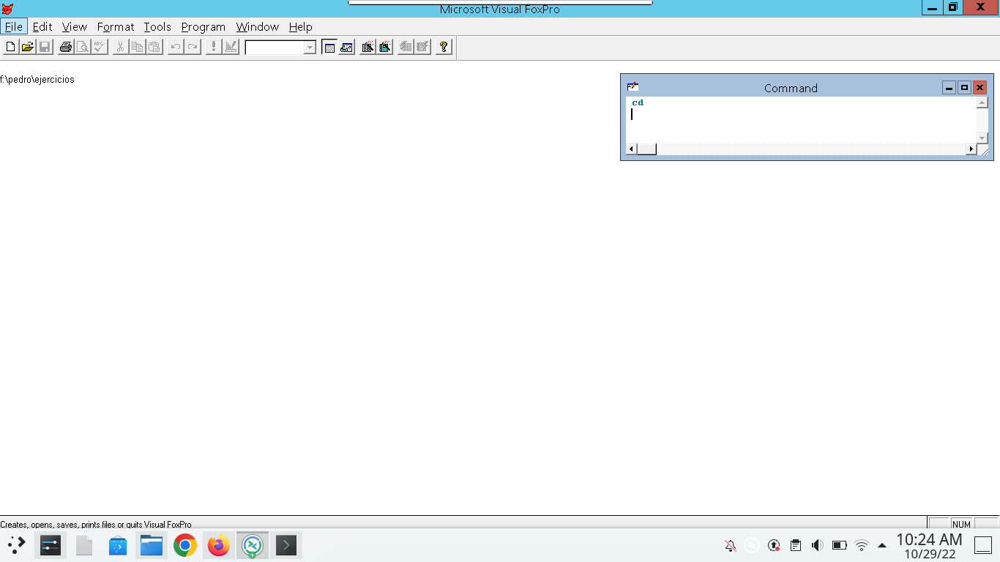
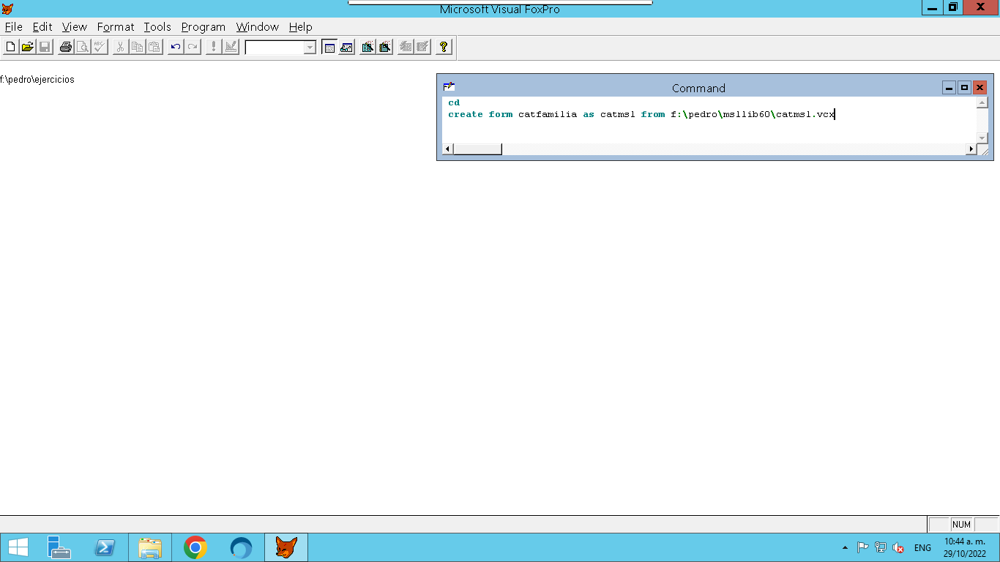
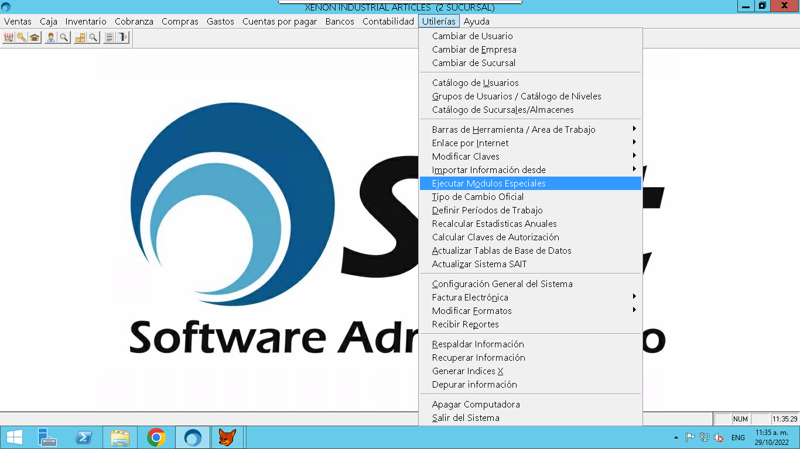
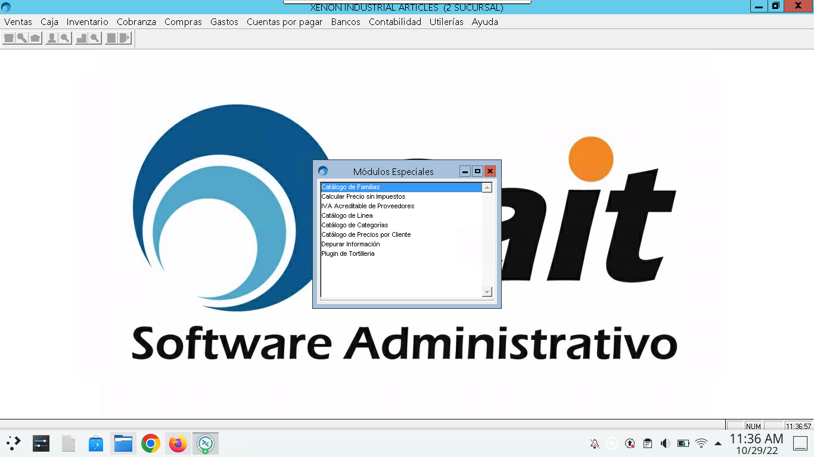
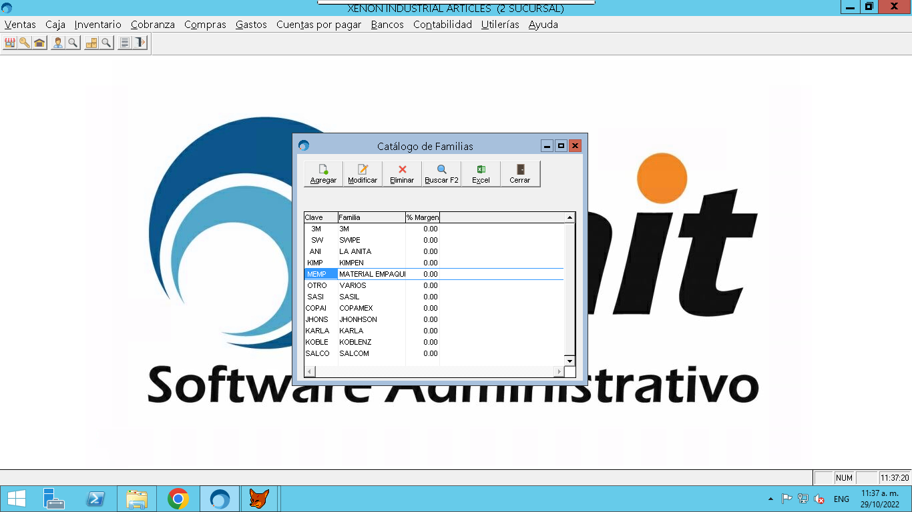

# Como se creo el catalogo de familias
### Fecha: 29 de Octubre de 2022
#### Pedro Javier Siqueiros Lopez

## Nota
Para poder realizar estos pasos es necesario tener instalada la libreria msllib60.

1. Posicionarse en un area de trabajo. Es importante elegir un espacio donde se guardaran los archivos que Visual FoxPro (VFP) va a generar.


2. Ahora hay que teclear el siguiente comando en la terminal de VFP


3. Resultado del comando anterior


4. Como se puede apreciar usar la libreria msllib60 con us clase catmsl facilita mucho crear nuevos catalogos con un solo comando, se recomienda agregar un titulo a la ventana en la propiedad caption para que al intentar mostrarlo dentro de SAIT en los modulos especiales sea facil de localizar.
5. Ahora solo faltan configurar algunas variables en la ventana, para ello creamos el evento init() de la ventana.
6. Recomiendo visitar el repositorio de SAIT en el siguiente enlace [Repositorio SAIT](https://github.com/sait/sdkdoc/) y buscar el enlace Desarrollos especiales en el README del repo.
7. Ese enlace nos dirigira a un archivo el cual contiene el codigo que debe ir en el evento init() de la ventana que estamos creando.
8. Se coloca el siguiente codigo en el evento init()

```
    	if not OpenDbf('Choferes', 'IDCHOFER')
		return .F. 
	EndIf
	*Permite abrir un archivo en modo compartido, con un índice predeterminado por cTag, y adicionalmente indicar bajo que Alias se desea identificar ese DBF. Regresa .t. si el DBF se pudo abrir,  .f. si hubo algún problema. Si no se pasa el 3er parámetro, entonces el nombre del archivo se considerara como Alias.

	* Alias donde se buscara la clave. Debe de estar activo el orden.
	this.cAlias = 'Choferes'
	* Nombre del catalogo. Usado para diferenciarlo de otros catálogos.
	this.cCatName = 'ChoferesCat'
	* Nombre de la forma a usar para hacer cambios en el catalogo.
	this.FormaCatalogo = 'ChoferesDat'
	* Nombre de la forma a usar para realizar una búsqueda. Debe ser modal y regresar la clave.
	this.FormaBusqueda = 'ListChofer()'
	* Ancho en píxeles, de las columnas.
	this.cAnchos = '80|100|100|50|100|100|100|100'
	* Títulos a desplegar en las columnas de la vista principal.
	this.cTitulos = 'clave|Nombre|Direccion|Número|Colonia|Ciudad|Telefono|Observaciones'
	* Campos a desplegar en la vista principal, separados con |
	this.cExprs = 'Choferes.IDCHOFER|Choferes.NOMBRE|Choferes.DIRECCION|Choferes.NUMERO|Choferes.COLONIA|Choferes.CIUDAD|Choferes.TELEFONO|Choferes.OBSERVACIONES'
```
9. Se sustituyen los valores que tiene la ventana por los que necesitemos.
10. Quedaria de la siguiente forma.

```
	if not OpenDbf('Familias', 'NUMFAM')
		return .F. 
	EndIf
	*Permite abrir un archivo en modo compartido, con un índice predeterminado por cTag, y adicionalmente indicar bajo que Alias se desea identificar ese DBF. Regresa .t. si el DBF se pudo abrir,  .f. si hubo algún problema. Si no se pasa el 3er parámetro, entonces el nombre del archivo se considerara como Alias.

	* Alias donde se buscara la clave. Debe de estar activo el orden.
	this.cAlias = 'Familias'
	* Nombre del catalogo. Usado para diferenciarlo de otros catálogos.
	this.cCatName = 'FamiliaCat'
	* Nombre de la forma a usar para hacer cambios en el catalogo.
	this.FormaCatalogo = 'Familias'
	* Nombre de la forma a usar para realizar una búsqueda. Debe ser modal y regresar la clave.
	this.FormaBusqueda = 'ListFam'
	* Ancho en píxeles, de las columnas.
	this.cAnchos = '50|100|50'
	* Títulos a desplegar en las columnas de la vista principal.
	this.cTitulos = 'Clave|Familia|% Margen'
	* Campos a desplegar en la vista principal, separados con |
	this.cExprs = 'Familias.NUMFAM|Familias.NOMFAM|Familias.MARGEN'
```
11. De esta forma se configura la ventana para que pueda ser ejecutada por los modulos especiales de SAIT.
12. Es necesario copiar y pegar los archivos generados por VFP en la carpeta demo de SAIT para probarla dentro del sistema.
13. Una vez copiado dentro de la carpeta demo abrimos los modulos especiales de SAIT 



14. Se mostrara una ventana como la siguiente



15. Catalogo de familias ejecutandose como modulo especial.

