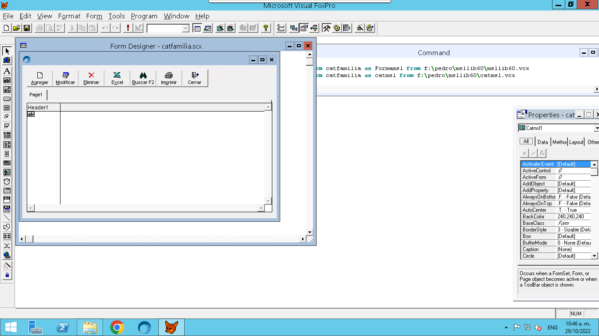

# Como se creo el catalogo de familias
### Fecha: 29 de Octubre de 2022
#### Pedro Javier Siqueiros Lopez

## Nota
Para poder realizar estos pasos es necesario tener instalada la libreria msllib60.

1. Posicionarse en un area de trabajo. Es importante elegir un espacio donde se guardaran los archivos que Visual FoxPro (VFP) va a generar.

2. Ahora hay que teclear el siguiente comando en la terminal de VFP

3. Resultado del comando anterior

4. Como se puede apreciar usar la libreria msllib60 con us clase catmsl facilita mucho crear nuevos catalogos con un solo comando.
5. Ahora solo faltan configurar algunas variables en la ventana, para ello creamos el evento init() de la ventana.
6. Recomiendo visitar el repositorio de SAIT en el siguiente enlace [Repositorio SAIT]()

